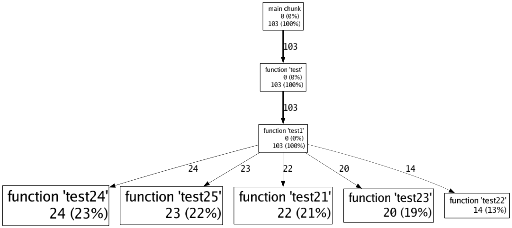
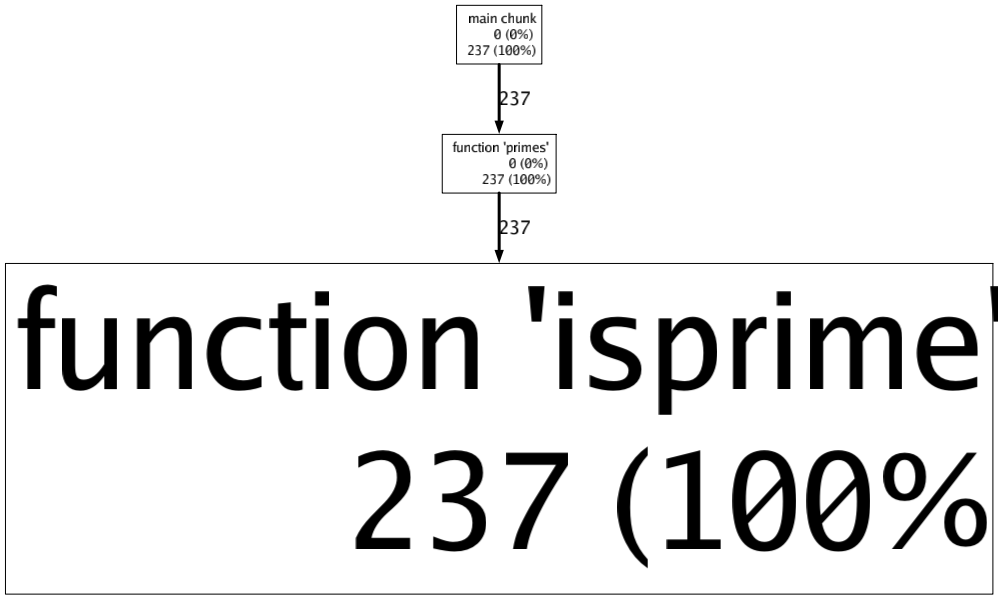

# pLua
Lua 性能分析工具
 
## 原理
类似于gperftools，通过定时器信号回调查看调用栈，来定位调用的热点

## 特性
- 简单，只需几行代码，即可输出结果
- 准确，相比lua hook，定时采样的方式更能准确捕获lua执行的热点
- 轻量，因为是采样的，相比直接按行lua hook，能最小程度影响宿主程序的运行
- 直观，输出调用图，能直观的看到热点和调用关系

## 使用
lua代码添加
``` lua
-- 引入libplua.so
local p = require "libplua"
-- 开启采样
-- 参数1：采样时间（秒），0表示一直采样
-- 参数2：采样结果文件
p.start(0, "call.pro")

do_some_thing()

-- 结束采样，输出结果文件
p.stop()

-- 把结果转成txt格式
p.text("call.pro", "call.txt")
-- 把结果转成dot格式，可用graphviz查看
p.dot("call.pro", "call.dot")
-- 把结果转成svg格式，可直接用浏览器打开查看
p.svg("call.pro", "call.svg")

```

## 编译
``` bash
$ cmake .
$ make
```

## 示例
运行```lua test1.lua```、```lua test2.lua```
查看svg结果

[test1]


[test2]


